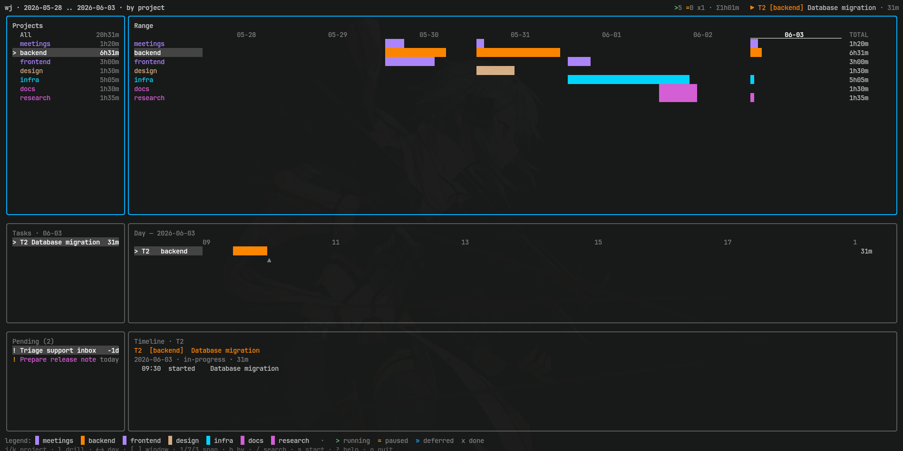

# wj — cross-project work journal & time tracker

A single, dependency-free bash CLI for tracking what you work on across every
project. Start, pause, resume, complete and defer tasks; see where your time
went on a slot-by-slot grid; and export everything to CSV/JSON for analysis.

An **optional** terminal UI (`wj-tui`) adds a multi-day Gantt overview with
project colors and an intraday drill-down — see [Terminal UI](#terminal-ui-optional).
The bash CLI is fully self-contained; the UI is a thin front-end over it and is
never required.



The source of truth is an **append-only, per-day TSV event log**. Every other
view — status tables, the schedule grid, reports, exports — is *derived* by
replaying that log. Your data stays plain text: greppable, diffable, and trivial
to analyse with `awk`, `sqlite`, a spreadsheet, or a notebook.

```
$ wj start "Refactor auth" --project backend
T1  09:00  [backend]  started T1 — Refactor auth

$ wj start "Standup" --project meetings      # different project → runs alongside
T2  09:30  [meetings]  started T2 — Standup

$ wj complete --project meetings
T2  09:45  completed — 15m

$ wj status

Tasks — 2026-06-01

ID    PROJECT           STATUS        TIME     DESCRIPTION
----  ----------------  ------------  -------  -----------
T1    backend           in-progress   1h00m    Refactor auth
T2    meetings          completed     15m      Standup

Total tracked: 1h15m
```

## Features

- **Cross-project** — one task list per day, shared across all your repos.
- **Concurrency-aware** — tasks run in parallel by default, including several in
  the same project; flip `auto_pause=on` (or pass `--auto-pause`) to keep one
  running task per project. Different projects always run at once (each is its
  own grid column).
- **Time grid** — a configurable slot grid (default 5-minute "jumps", framed at
  09:00–19:00 but auto-expanding to fit any out-of-hours work) visualises the
  shape of your day. Comment out the shift bounds for a full 24h / auto-fit grid.
- **Multi-day overview** — `wj gantt` prints a projects(or tasks)×days matrix of
  time totals right in the terminal (the CLI counterpart of the TUI's Range view).
- **Machine-readable** — `status`, `show`, `grid`, `gantt`, `search`, `pending` and
  `team` accept `--json` for a stable contract that tooling (and the `wj-tui`
  front-end) can consume.
- **Retroactive** — `--at HH:MM` backfills past times; chain it to reconstruct a
  whole day after the fact.
- **Exportable** — dump the raw event log to `csv`, `json`, or `tsv`, or roll it
  up with `report`.
- **No dependencies** — the CLI is pure bash + coreutils (`git` is used only to
  auto-detect a project name inside a repo, and is optional). No `jq`, no
  database. (The optional `wj-tui` front-end is a separate, statically-linked Go
  binary — needed only if you opt into the UI.)
- **Optional terminal UI** — a lazygit-style `wj-tui` with a colored multi-day
  Gantt and intraday drill-down, driven entirely by the CLI's `--json` output.

## Install

One line — no clone needed:

```sh
curl -fsSL https://raw.githubusercontent.com/Katestheimeno/wj/main/install.sh | bash
```

This fetches `wj` and installs it to `~/.local/bin/wj`. If that dir isn't on your
`PATH`, the installer tells you the line to add to your shell rc.

> Prefer not to pipe to `bash`? Download `install.sh`, read it, then run it.

**Options** (pass after `bash -s --`, or as flags when running the script directly):

```sh
# Uninstall (keeps your config & data)
curl -fsSL https://raw.githubusercontent.com/Katestheimeno/wj/main/install.sh | bash -s -- --uninstall

# Uninstall and delete config + data too
curl -fsSL https://raw.githubusercontent.com/Katestheimeno/wj/main/install.sh | bash -s -- --uninstall --purge
```

| Env var | Default | Purpose |
|---|---|---|
| `WJ_BIN_DIR` | `~/.local/bin` | Where to install/remove the binary. |
| `WJ_REF` | `main` | Git branch/tag to install from. |
| `WJ_WITH_UI` | `0` | Set to `1` (or pass `--with-ui`) to also build the UI. |

To install the optional terminal UI as well (needs [Go](https://go.dev/dl)):

```sh
curl -fsSL https://raw.githubusercontent.com/Katestheimeno/wj/main/install.sh | bash -s -- --with-ui
```

### Arch Linux (AUR)

On Arch and derivatives, install the [`wj`](https://aur.archlinux.org/packages/wj)
package from the AUR. This bundles everything — the CLI, the `wj-tui` front-end,
the man page, and bash completions — and keeps it updated through your AUR helper:

```sh
yay -S wj      # or: paru -S wj
```

### Build from source (with `make`)

Clone the repo and use the Makefile to install both the CLI and the UI (the man
page comes along automatically). Needs Go for the UI.

```sh
git clone https://github.com/Katestheimeno/wj.git && cd wj

make install                 # build wj-tui, install wj + wj-tui + man -> ~/.local
hash -r                      # refresh your shell's command cache

# remove it again (keeps your config & data):
make uninstall

# reinstall:
make install && hash -r
```

Targets: `make install-cli` (just the bash CLI + man), `make install-ui` (just
the UI binary), `make clean`. Override the location with `PREFIX`, e.g. a
system-wide install: `sudo make install PREFIX=/usr/local`.

**Testing.** `make test` runs both suites: `make test-cli`
([bats](https://bats-core.readthedocs.io) tests for the bash CLI, under
[`tests/`](tests/)) and `make test-go` (the Go suite for `wj-tui`). `make lint`
runs golangci-lint and `make cover` reports Go coverage.

> **Note on PATH:** if an older `wj` is already installed (e.g. a system package
> in `/usr/bin`), it may shadow `~/.local/bin/wj`. Remove the old one first
> (e.g. `sudo pacman -Rns wj`) and run `hash -r`. Check with `command -v wj`.

### Manual install (CLI only, no Go)

```sh
git clone https://github.com/Katestheimeno/wj.git && cd wj
chmod +x wj
ln -s "$PWD/wj" ~/.local/bin/wj          # or: sudo ln -s "$PWD/wj" /usr/local/bin/wj
```

First run seeds a config file at `~/.config/wj/cfg`. Data is written under
`~/.local/share/wj/`. Both locations are overridable (see [Configuration](#configuration)).

## Commands

| Command | What it does |
|---|---|
| `wj start <desc\|P#>` | Begin a new task (next id `T1`, `T2`… per day). Runs alongside any task already going in the same project (pass `--auto-pause`, or set `auto_pause=on`, to pause it first). Given a pending id (`P#`) it promotes that backlog item instead (see [Pending backlog](#pending-backlog)). |
| `wj continue <id> --date <day>` | Pick up a past day's task today: copies its description, project, **and tags** into a fresh task for today (new id, own clock) and notes the lineage. The `--date` source day is required. |
| `wj pause [id] [why]` | Pause the running task (or a given id). Stops its clock. |
| `wj resume [id]` | Resume the most-recent paused/deferred task (or a given id). |
| `wj complete [id]` | Finish a task and sum its tracked time. |
| `wj defer [id] [why]` | Set a task aside (blocked, or for another day). |
| `wj log <note>` | Attach a timestamped note to the running task. |
| `wj amend [id] <desc>` | Replace a task's description (running task, or a given id). Appends an event — history is never rewritten. |
| `wj move [id] <proj>` | Re-home a task to another project (fix wrong auto-detection). |
| `wj tag <id> <tag…>` | Add one or more free-form labels to a task — a cross-cutting axis beside its project. Normalized (lowercased; a leading `#` and spaces stripped, so `"High Priority"` → `high-priority`). Matched by `search`, aggregated by `report --by tag`. |
| `wj untag <id> <tag…>` | Remove labels from a task. |
| `wj cancel [id]` | Void a mistaken task: 0 time, hidden from status/grid/report (kept in the raw log for audit). |
| `wj undo` | Take back the last logged event on a day (today, or `--date`) — drops the log's last line. Repeat to walk further back. (`continue` writes 2–3 events — start, lineage note, and tags — so undoing a carry-over takes a couple of passes.) |
| `wj ls` | List currently-open tasks (in-progress / paused / deferred). Today by default; `--days N` scans the last N days (adds a DATE column) to catch timers left running earlier. |
| `wj show <id>` | Full timeline of one task: start, notes, pauses/resumes, renames, moves, total time and status. Today by default; `--date` for a past day. |
| `wj status [date]` | Per-task totals table for a day (default: today). **Default command.** |
| `wj grid [date]` | Slot-by-slot schedule for a day. |
| `wj gantt [flags]` | Multi-day overview: a rows×days matrix of time totals. Rows are projects (or per-day tasks with `--by task`); columns are days. Default range: the last 7 days through `--to` (or today). Cancelled and zero-time rows are omitted. The CLI counterpart of the TUI's Range view. |
| `wj search <query>` | Find tasks across **all** recorded days by a case-insensitive substring of the id, project, description, **or tags**. Most-recent first; `--json` for the UI's `/` overlay. |
| `wj report [flags]` | Aggregate time over a date range, grouped by `--by`. |
| `wj export [flags]` | Dump raw events as csv/json/tsv over a date range. |
| `wj sync init <url>` | Turn the data dir into a shared git journal (see [Collaboration](#collaboration-shared-journal)). Run once per machine. |
| `wj sync` | Share/receive work: commit, pull (rebase), push. `wj sync status` shows ahead/behind. |
| `wj ui` | Launch the optional `wj-tui` front-end (see [Terminal UI](#terminal-ui-optional)). A bare `wj` opens it too when `interface=ui`. |
| `wj completion <shell>` | Print a shell-completion script (`bash` or `zsh`). |
| `wj config` | Print the active config file path. |
| `wj version` | Print the version (also `--version`, `-V`). |
| `wj help` | Full help. |

### Flags

| Flag | Applies to | Purpose |
|---|---|---|
| `--at TIME` | start, pause, resume, complete, defer, log, amend, move, cancel, status, grid, show | Act at a past time instead of now. Flexible format — `9`, `930`, `0930`, `9:30`, `9.30`, `9am`, `9pm`, `9:30pm` all normalise to `HH:MM`. Backfills the grid. |
| `--date YYYY-MM-DD` | any write command + status, grid, ls, show | Act on another day, not today (alias `--on`). Combine with `--at` to reconstruct any past day. On a past day **without** `--at`, the time is inferred from that day's last event (or `shift_start`) and the inference is printed. |
| `--project NAME` | start (where the task lives); pause/complete/defer/log/resume/amend/cancel (scope) | Override project detection. Quote names with spaces. |
| `--from D --to D` | report, export, gantt | Inclusive date range `YYYY-MM-DD`. For `gantt`, `--to` (or `--date`/`--on`) is the range end and `--from` the start; if `--from` is omitted it defaults to 6 days before `--to` (last 7 days). For `report`/`export`, default is today. |
| `--by KEY` | report, gantt | Group rows. `report`: `project` \| `task` \| `day` \| `tag` \| `person`. `gantt`: `project` \| `task` \| `person`. Default: `project`. (`--by tag` fans a task out across each of its tags, so the report TOTAL can exceed real tracked time; `--by person` groups by author in a shared journal.) |
| `--format FMT` | export | `csv` \| `json` \| `tsv`. Default: `csv`. |
| `--days N` | ls | How many days back to scan for open tasks. Default: `1` (today). |
| `--due YYYY-MM-DD` | add | Optional deadline for a pending task. |
| `--parallel` / `--auto-pause` | start, resume | Override the `auto_pause` config for one command. `--parallel` leaves any other running task in the same project running; `--auto-pause` pauses it first (one in-progress task per project). |
| `--json` | status, show, grid, gantt, search, pending, team | Emit machine-readable JSON instead of the text table — a stable contract (this is what the `wj-tui` front-end consumes). |

If you omit `--project` on `pause`/`complete`/`log`/`amend`/`move`/`cancel`, the
command acts on whatever is currently running. Pass `--project` to scope it to one
project, or a task id (`T2`) to target a specific task in any state.

The state changes are **idempotent**: repeating an action whose state the task
already holds is a no-op. `pause` on an already-paused task (or `resume` on a
running one, `complete` on a completed one, `defer`/`cancel` likewise) writes
nothing to the log and just prints, e.g., `T1  already paused`.

### Pending backlog

Tasks you intend to do but haven't started yet live in a separate backlog
(`P1`, `P2`… ids, stored in `pending.tsv`). They carry an optional project and
deadline and stay **out of** the time views — status, grid, gantt, reports — until
you start one, at which point it becomes a normal tracked task.

| Command | What it does |
|---|---|
| `wj add <desc>` | Add a backlog task. `--project NAME` sets its project; `--due YYYY-MM-DD` a deadline. |
| `wj pending` | List the backlog in manual (pinned) order. |
| `wj due <P#> <date\|->` | Set, or clear (`-`), a pending task's deadline. |
| `wj raise <P#>` / `wj lower <P#>` | Move a pending task one step up / down. |
| `wj drop <P#>` | Remove a pending task without starting it. |
| `wj assign <P#> <who>` | Hand a backlog item to a teammate (it moves to their list as `who/P#`). Shared-journal only — see [Collaboration](#collaboration-shared-journal). |
| `wj start <P#>` | Promote: start the task now (carrying its desc + project) and remove it from the backlog. |

In a [shared journal](#collaboration-shared-journal) the backlog is also
author-partitioned: `wj pending` shows everyone's (yours as `P#`, teammates' as
`alice/P#`), `wj pending --mine` filters to yours, and you act on your own items.
`wj assign <P#> <who>` hands one of yours to a teammate, and `wj assign alice/P1 me`
claims a teammate's item for yourself.

**Shell completion** completes commands, flags, task ids, project names, and tags.

- **bash:** the package already installs it to `bash-completion`'s directory (or
  add `eval "$(wj completion bash)"` to `~/.bashrc`). Needs the `bash-completion`
  package active.
- **zsh:** the bridge needs `compinit` to have run **first**, so in `~/.zshrc`:

  ```zsh
  autoload -U compinit && compinit
  eval "$(wj completion zsh)"
  ```

  (If `eval "$(wj completion zsh)"` alone gives `compdef: command not found`, the
  `compinit` line above is missing or comes after it.)

## How it works

### The event log

Each day is one tab-separated file. Every action appends one row; nothing is ever
rewritten:

```
timestamp           task_id  project        event     note
2026-06-01T09:00    T1       backend        start     Refactor auth
2026-06-01T09:30    T1       backend        pause     heading into standup
2026-06-01T09:30    T2       meetings       start     Standup
2026-06-01T09:45    T2       meetings       complete
2026-06-01T11:00    T1       backend        resume
2026-06-01T11:30    T1       backend        complete
```

Events: `start` · `pause` · `resume` · `complete` · `defer` · `log` · `amend` · `move` · `tag` · `untag` · `cancel`.
A task's description is the note on its `start` event; its status, time totals and
grid placement are all computed by replaying the rows.

### Statuses & grid symbols

| Status | Grid |
|---|---|
| in-progress | `>>` |
| paused | `--` |
| completed | `**` |
| deferred | `~~` |
| idle | _(blank)_ |

### Time totals

Totals sum the active intervals between `start`/`resume` and `pause`/`complete`/`defer`.
With `totals=exact` (default) they're exact to the minute; with `totals=slot` each
total rounds up to a whole `slot_minutes`. A still-running task counts up to "now"
(or, on a past day, that day's last recorded event — never a guessed shift end).
Time tracked outside shift hours is counted in full. The grid is always
slot-aligned for display, independent of how totals are summed.

## Configuration

`~/.config/wj/cfg` (seeded on first run). It's a small INI file — `[section]`
headers with `key = value` lines underneath — parsed (not executed), grouped
into `[tracking]`, `[ui]`, and `[colors]`. `#` starts a comment (a leading-`#`
value like a hex color is kept). A legacy `~/.config/wj/config` from an older
version is migrated to `cfg` automatically on first run (the original is kept as
`config.bak`).

| Key | Default | Meaning |
|---|---|---|
| `shift_start` / `shift_end` | `09:00` / `19:00` | Default grid/gantt frame. The window auto-expands to fit any work tracked outside it; **comment either line out** (or leave it empty) to drop the fixed frame and auto-fit the grid to each day (e.g. a full 24h). |
| `slot_minutes` | `5` | Grid time-step — the "jump" between slots. |
| `round` | `down` | Grid snapping of event times: `down` or `nearest`. |
| `totals` | `exact` | Time summing: `exact` minutes or `slot`-rounded. |
| `default_project` | `admin` | Project used outside a git repo when no `--project` is given. |
| `actor` | _(empty)_ | Author handle stamped on your events in a [shared journal](#collaboration-shared-journal). Empty derives it from your git `user.email` local-part, then `$USER`; normalized to `a-z0-9-`. Pin it (e.g. `actor = alice`) so your id is stable across machines. |
| `interface` | `minimal` | Front-end for bare `wj`: `minimal` (status table) or `ui` (launch `wj-tui`). |
| `auto_pause` | `off` | On `start`/`resume`, auto-pause another running task in the same project. `off` runs them in parallel; override per command with `--parallel` / `--auto-pause`. |
| `accent` | `141` | `wj-tui`'s border/header color — the focused panel's border. A 256-color code (`141`), a hex value (`#9d7cd8`), or an ANSI name (`purple`). |
| `layout` | `balanced` | `wj-tui`'s panel layout: `balanced`, `spotlight` (focused panel dominates), `golden` (wider sidebar, uneven splits), or `custom` (see below). Shift+L cycles them live; on a too-small terminal it auto-falls back to `balanced`. |
| `sidebar` | `left` | Which side the `wj-tui` lists column sits on: `left` or `right`. |
| `confirm` | `destructive` | `wj-tui`'s y/n guard before an action: `all` (every action confirms), `destructive` (only `cancel`/void and pending `drop`), or `off` (none — `u` undo is the safety net). |
| `icons` | `off` | `wj-tui`'s status markers and indicators (the `>`/`=`/`»`/`x` task glyphs, the running-task marker, pause-mode badge, now-marker, scroll/`more` arrows, etc.). `off` keeps everything in a universal ASCII set that renders in any font; `on` uses Nerd-Font icons (needs a [patched font](https://www.nerdfonts.com)). A terminal app can't detect a font's glyphs, so this is an explicit opt-in rather than auto-detection. |
| `auto_sync` | `5` | `wj-tui`'s background git-sync interval, in **minutes**: how often it runs `wj sync` (pull + push) to share/receive a [shared journal](#collaboration-shared-journal). `0` (or `off`) disables it, leaving the manual `S` key. Only acts once the data dir is a sync repo (`wj sync init`). |
| `layout_sidebar` / `layout_split` | — | Define a `custom` layout: `layout_sidebar` is the sidebar width percent (e.g. `28`); `layout_split` is the panel weights `focused,hi,lo` (e.g. `60,25,15` — the focused panel gets 60% of its column, the other two split the rest 25:15). Select with `layout=custom`. |
| `color_projects` / `color_tasks` / `color_pending` / `color_range` / `color_day` / `color_timeline` | `39` / `214` / `170` / `78` / `45` / `180` | `wj-tui`'s per-panel title colors — each panel keeps its own so they stay visually distinct. Same value formats as `accent`. |

Environment overrides:

- `WJ_CONFIG` — path to the config file (default `$XDG_CONFIG_HOME/wj/cfg`).
- `WJ_DATA_DIR` — root of the data tree (default `$XDG_DATA_HOME/wj`, i.e. `~/.local/share/wj`).

`XDG_CONFIG_HOME` / `XDG_DATA_HOME` are honored as the base for those defaults.

## Data layout

```
~/.config/wj/cfg                     # settings (INI: [tracking] [ui] [colors])
~/.local/share/wj/
├── 2026/06/01.tsv                    # one append-only event log per day
│                                     #   (in a shared journal: 01.<actor>.tsv,
│                                     #    one per author; reads union them all)
└── pending.tsv                       # the backlog (pending.<actor>.tsv when shared)
```

Project detection order: git remote basename → repo folder name → `default_project`
(lowercased).

## Terminal UI (optional)

`wj-tui` is an optional, lazygit-style front-end. It renders the event log via
the CLI's `--json` output and triggers actions by calling `wj` — so the bash CLI
stays the single source of truth, and the UI can never disagree with it.

The layout fills the whole terminal: a narrow **sidebar** of lists drives a wide
**main** column of detail. The header shows the running task with a live clock
plus a today rollup (`>1 =0 x4 · Σ2h39m`); `?` opens a full keybinding overlay.
Navigation is vim-style — `j`/`k` move within the focused panel, `h`/`l` (like
`Shift-Tab`/`Tab`) cycle every panel with wraparound, `1`-`4` jump straight to
Projects/Tasks/Timeline/Pending, `←`/`→` step days, `g`/`G` jump to first/last,
`Ctrl-d`/`Ctrl-u` half-page. `Enter` drills in (and promotes a pending task).


Sidebar:

- **Projects** — two stacked sections: **Today** (today's projects from the live
  status, independent of the browsing window — its running project counts up live)
  on top, then **Window** (every project, or task, in range, led by an `All` row).
  Each section header shows its subtotal. Selecting a row filters the day's Tasks
  to it (master→detail); picking a **Today** project also jumps the day view to
  today. The project running right now is flagged `>`. `j`/`k` flow across both
  sections and **`T`** toggles between them; `[`/`]` shift the window, `t` jumps
  to today, `⇧1`/`⇧2`/`⇧3` set the span (1/7/30 days), `b` toggles project/task rows.
- **Tasks** — the focused day's tasks, each led by a status glyph: `>` running,
  `=` paused, `»` deferred, `x` done.
- **Pending** — the [backlog](#pending-backlog): `a` add (`desc @project
  !YYYY-MM-DD`), `d` set/clear the due date, `[`/`]` reorder, `x` drop, `Enter`
  to start (promote). Deadlines are colored by urgency (overdue red, due-soon amber).
  Because the list is narrow, focusing this panel shows the **selected item in
  full** — its word-wrapped description plus project, due date, and created time —
  in the main column (where the Timeline normally sits).

Main:

- **Range** — a multi-day Gantt: one row per project (or task), one column per
  day, with project-colored intensity bars.
- **Day** — the focused day's intraday Gantt: a time axis framed by the shift
  bounds (auto-expanding to fit any out-of-hours work, or auto-fitting the day
  when the bounds are unset) with a `now ▲` marker and colored segment bars per task.
- **Timeline** — the selected task's full event history.

`/` opens a global **search** overlay: type to filter every task ever recorded
(by id, project, or description); `Enter` jumps to a match, windowing the range
onto its day and selecting it.


Mutations run the same commands as the CLI, on the selected task: `p` pause,
`r` resume, `c` complete, `d` defer, `a` amend, `m` move (with `⇥` project
autocomplete), `n` log a note, `#` edit **tags** (space-separated; a `-tag`
removes; `⇥` completes a known tag), `x` cancel (void), and `o` carry a past
day's task over to today (with its tags); `u` undoes the last logged event on the
focused day.
Tags are a cross-cutting label beside the project — they show as `#chips` on the
Timeline and search results, `/` search finds them, and `wj report --by tag`
aggregates by them. `s` starts a
brand-new task — type a description with an optional inline `@project` (`⇥`
completes a known project, or just type a new name; omit it to auto-detect) and
an optional inline `%time` (e.g. `%9:30`) to backdate the start — omit it for now.
`A` toggles how `start`/`resume` treat another running task in the same project —
`∥ parallel` (the default) keeps it running, `⇄ 1-at-a-time` auto-pauses it first;
the current mode shows next to the running-task header.

An action can pop a **y/n confirm** first (`y`/`Enter` accepts, `n`/`Esc`
declines); how many do is set by the `confirm` [config](#configuration) — `all`
(every action), `destructive` (the default — only `cancel`/void and pending
`drop`), or `off`. In any **text prompt**, editing is readline-style: `←`/`→` and
`Home`/`End` (or `Ctrl+A`/`Ctrl+E`) move the caret, `⌫`/`Del` delete a character,
and **`Ctrl+W`** (or **`Ctrl+Backspace`**) deletes the previous word.

To do any of `pause`/`resume`/`complete`/`defer`/`cancel` **at an explicit time**
rather than now, use the **Shift** variant — `P`/`R`/`C`/`D`/`X` — which opens a
one-line time prompt and runs the command with `--at` (a blank entry cancels;
`X` confirms the void first, then asks for the time). Acting on a **past** day
also prompts for a time, so an edit can't collapse to a zero-length interval.
Colors are assigned per project (stable across days, including `--by task` rows)
and respect `NO_COLOR`. The chrome is themable from the [config](#configuration):
`accent` sets the focused panel's border (and header), and each panel has its own
title color — `color_projects`, `color_tasks`, `color_pending`, `color_range`,
`color_day`, `color_timeline` — so the six panels stay visually distinct. Each
takes a 256-color code, a hex value (`#9d7cd8`), or an ANSI name. The status
markers (`>` running, `=` paused, `»` deferred, `x` done) **and every other
indicator** (the running-task marker, pause-mode badge, now-marker, `more`
arrows, …) are plain ASCII by default so they render in any font; set
`icons=on` to switch them all to Nerd-Font icons (requires a [patched
font](https://www.nerdfonts.com) — there's no reliable way for a terminal app to
detect glyph support, so it's opt-in, and either mode is fully self-consistent).

The panel **layout** is configurable too: `balanced` (the default — the focused
panel takes ~half its column), `spotlight` (the focused panel dominates, the rest
shrink to thin strips but never below a readable minimum), or `golden` (a wider
sidebar and uneven 62/23/15 splits). Set the startup default with `layout=` in
the config, or press **Shift+L** to cycle them live; on a terminal too small for
the chosen layout it quietly falls back to `balanced` so nothing gets crushed.
Define your own proportions with `layout_sidebar` / `layout_split` (a `custom`
layout), put the lists on the right with `sidebar=right`, and press **`z`** to
zoom the focused panel to full-screen (Esc or `z` again to return — navigation
still works while zoomed, so the view follows your focus). An empty **Pending**
backlog collapses to a slim strip so its space goes to the other lists.

Every action echoes the CLI's confirmation in the footer — a cyan `✓` line such
as `✓ T1 12:30 completed — 1h30m`, or, for an [idempotent](#commands) no-op,
`✓ T1 already paused`; failures show in a red `⚠` line instead. The next keypress
dismisses it.

`Ctrl+Z` suspends `wj-tui` to the background (standard job control); run `fg` to
bring it back — it refreshes from disk on resume. `Ctrl+R` reloads, `q`/`Ctrl+C`
quits.

```sh
make install-ui            # build & install wj-tui (needs Go)
wj ui                      # launch it explicitly
# …or set `interface=ui` in the config so a bare `wj` opens it.
```

Install it via `--with-ui` (see [Install](#install)). If `wj-tui` isn't present,
`interface=ui` silently falls back to the status table, and `wj ui` prints a
clear error — the CLI never depends on it.

### Try it with demo data

To explore the UI (or the CLI) without touching your own log, the repo ships a
seed script that reconstructs a sample work-week — five recent days across a
handful of projects, with pauses, a deferral, a re-homed task, two tasks left
running *today* (so the header clock ticks), and a pending backlog — into a
throwaway data dir:

```sh
make tui                       # build ./tui/wj-tui (needs Go)
./tui/demo/seed-demo.sh        # populate /tmp/wj-demo via the real CLI

# launch the UI against the demo data — your real log stays untouched:
WJ_DATA_DIR=/tmp/wj-demo WJ_CONFIG=/tmp/wj-demo/config ./tui/wj-tui
```

The dates are anchored to today, so it's always "this past week". The same two
env vars point the plain CLI at the demo too — e.g.
`WJ_DATA_DIR=/tmp/wj-demo WJ_CONFIG=/tmp/wj-demo/config wj gantt`. Re-run the
script anytime to reset it; `rm -rf /tmp/wj-demo` removes it.

## Analysis & export

```sh
# Multi-day shape of the last week, by project (text matrix):
wj gantt

# A specific window, one row per task, as JSON for tooling:
wj gantt --from 2026-06-01 --to 2026-06-07 --by task --json

# Where did June go, by project?
wj report --from 2026-06-01 --to 2026-06-30 --by project

# Per-day breakdown:
wj report --from 2026-06-01 --to 2026-06-30 --by day

# Raw events to CSV for a spreadsheet / notebook:
wj export --from 2026-06-01 --to 2026-06-30 --format csv > june.csv

# Or query the TSV directly — it's just text:
awk -F'\t' '$4=="complete"{print $3}' ~/.local/share/wj/2026/06/*.tsv | sort | uniq -c
```

`export` emits well-formed CSV (RFC-4180 quoting) and JSON (validates as a JSON
array), so it drops straight into pandas, `jq`, SQLite, or any spreadsheet.

## Collaboration (shared journal)

wj can be a **shared, multi-author work journal** — over plain **git**, no server.
It works because the log is append-only and *partitioned by author*: each person
writes their own per-day file (`YYYY/MM/DD.<actor>.tsv`), and reads union every
author's file. Two people working the same day never touch the same file, so git
has nothing to conflict on; a `*.tsv merge=union` rule handles even the
same-person-on-two-machines case by keeping all events.

Set up once per machine, then sync whenever:

```sh
wj sync init git@github.com:team/journal.git   # one-time: wire up the shared repo
wj sync                                         # commit + pull --rebase + push
wj sync status                                  # branch, clean/dirty, ahead/behind
```

- **Authorship** is the `actor` config (defaults to your git email's local-part,
  then `$USER`). Pin it with `actor = alice` in the config.
- After a sync, reads show **everyone's** tasks — yours as bare `T1`, teammates'
  qualified as `alice/T1`. Project/range rollups (`gantt`, `report`) sum the whole
  team; your personal views (status header, today) stay yours. You can act on your
  own tasks; a teammate's is read-only.
- **Auth:** keep your ssh key in an agent (unlock once) and sync is silent.
  Non-interactive callers (auto-sync, the TUI's `S`) never hang on a passphrase —
  they fail cleanly and tell you to unlock. Or use an HTTPS token / passphrase-less
  deploy key for fully unattended sync.
- **Privacy:** the synced repo is the *team* journal. Keep private work in a
  separate, non-synced data dir via `WJ_DATA_DIR`.

### Team views & filters

```sh
wj team                       # who's running what right now (+ each one's day total)
wj report --by person         # range rollup of tracked time per author
wj gantt  --by person         # the multi-day grid, one row per author
wj status --mine              # just your own tasks (status/grid default to everyone)
wj pending --mine             # just your own backlog
```

In the TUI:

- **`S`** forces a sync; the front-end also **auto-syncs every `auto_sync`
  minutes** (config, default 5; set `auto_sync = 0`/`off` for manual-only). It
  only runs once the data dir is a sync repo, and a `syncing…` hint shows it.
- **`w`** opens a live **team** overlay (who's on what + day totals).
- **`b`** cycles the Range rows **project → task → person**.
- **`M`** toggles the day's Tasks panel between **everyone** and **mine**.
- Teammates' tasks and backlog items are tinted by author and read-only.

## Retroactive entry

`--at` lets you log work after the fact; chain it to rebuild a whole morning:

```sh
wj start "Fixing auth flow" --at 09:00 --project backend
wj pause standup            --at 09:30
wj start "Code review"      --at 09:30 --project reviews
wj complete T2              --at 10:00
wj resume T1                --at 10:00
wj complete                 --at 11:30 --project backend
```

## Design notes

- **Append-only:** commands read the log, then append — they never rewrite it, so
  the history is auditable and safe to sync.
- **Task ids are per-day** (`T1`, `T2`…). Continuing yesterday's work is a fresh
  task today (give it a note); ids are not linked across days.

## License

Apache License 2.0 — see [LICENSE](LICENSE).
